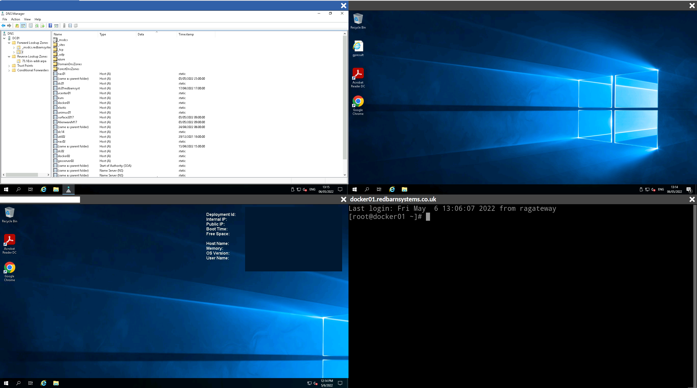
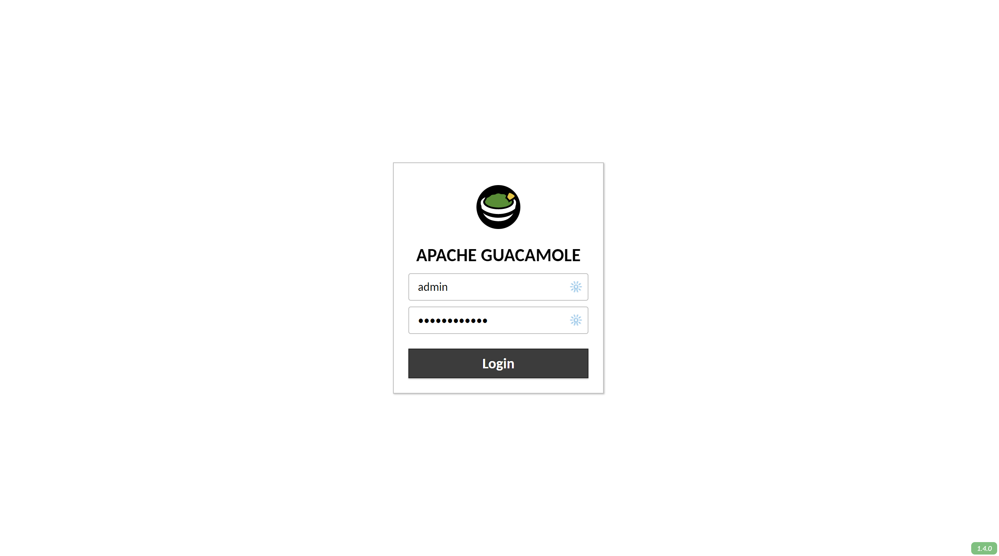

# Remote Access Gateway

## Overview

The Remote Access Gateway is a set of build scripts that builds and installs all the dependencies required for a basic [Apache Guacomole](https://guacamole.apache.org/) configuration.

The primary purpose of these scripts was to be able to deploy a remote access capability to an airgapped environment deployed in Azure in order to remove the need for Azure Bastion which is horrendoulsy expensive for small environments.  The capability enables a level of out of band management even when the underlying VMs have no internet access.  As long as the RAGateway machine has connectivity to the VMs you want to connect to, you can manage them.

Guacamole supports, RDP, SSH and VNC connections and these scripts build support for all protocols.  In addition, with extra configuration you can access the airgapped machines' filesystem enabling you to perform file transfers, all from a single web portal.

Several remote sessions can be shown at once on a single screen and bookmarked in your browser for rapidly bringing up machine sets.  This is particulartly useful for giving demos etc.



This script installs the basic Guacamole server and creates with some demo VM connections which will need to be altered by editing the /etc/guacamole/user-mapping.xml file on the RAGateway/Guacamole itself.

The script has been tested on CentOS7 but should work on CentOS8 and Red Hat equivalents.

## Installation

Create a base installation of a CentOS 7 machine and copy the bootstrap.sh file onto it.

Login/elevate yourself to root and make the script executeable

```
> chmod +x bootstrap.sh
```
Run she script to install the RAGateway
```
> ./bootstrap.sh
```


## Accessing the Server

Navigate to the web portal of the Remote Access Gateway

```
http://<server address>:8080/ragateway/#/
```

At the login prompt the use the login details:

```
Username: admin
Password: Password123!
```



The /etc/guacamole/user-mapping.xml file initially contains and example configuration for one ssh connection and one RDP connection under the admin user.  You will need to modify these and add more connection definitions within /etc/guacamole/user-mapping.xml to reflect your environment.

Please refer to the [Using Guacamole](https://guacamole.apache.org/doc/gug/using-guacamole.html#using-guacamole) documentation for in depth instructions on using the Remove Access Gateway.
